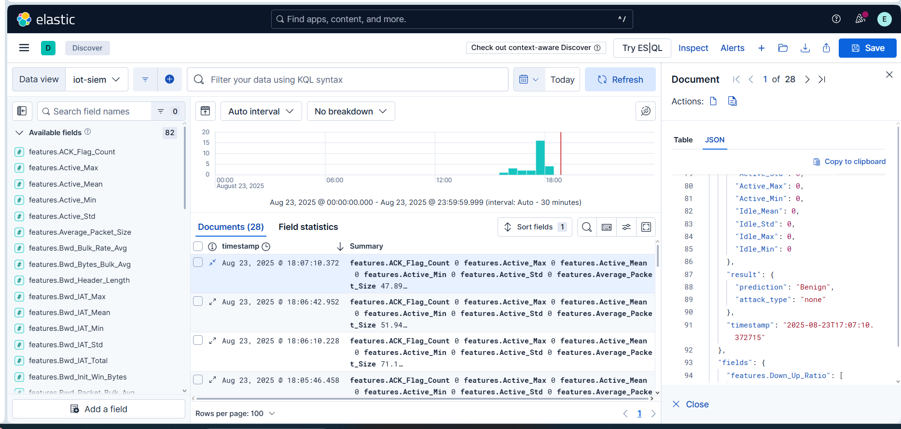
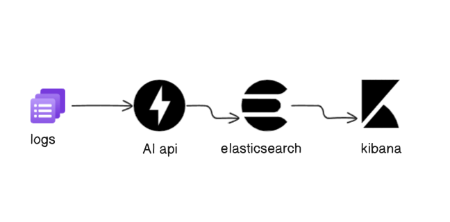

# IOT-AI-Powered-SIEM




### Project Overview :

This project is a proof of concept for an AI-powered Security Information and Event Management (SIEM) system designed to monitor IoT devices in real time. The system leverages machine learning to detect anomalies and potential attacks on IoT networks.

The AI model is trained on a dataset from the Canadian Institute for Cybersecurity (CIC), where an IoT lab was simulated, multiple attack scenarios were launched, and network traffic was intercepted. Among the models tested, XGBoost provided the best detection performance.

The trained model is deployed using FastAPI and integrated with Elasticsearch and Kibana for real-time monitoring and visualization of IoT traffic.

#### Features : 

   - Real-time monitoring of IoT network traffic

   - Detection of various types of attacks using machine learning

   - Interactive visualization and dashboards via Kibana

   - Easy integration with existing systems through REST API

     
### Architecture :



### Installation  :

```bash
# Clone the repository
git clone https://github.com/ruebee08/IOT-AI-Powered-SIEM.git
cd IOT-AI-Powered-SIEM

#install dependencies for the api
cd /api
pip install -r requirements.txt
